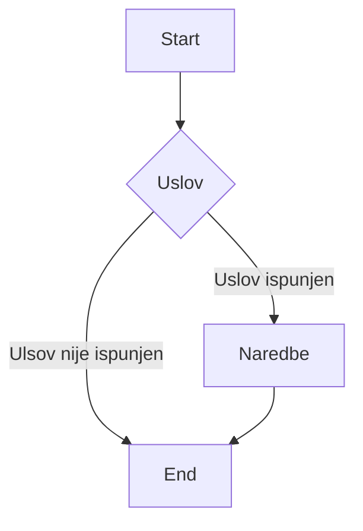
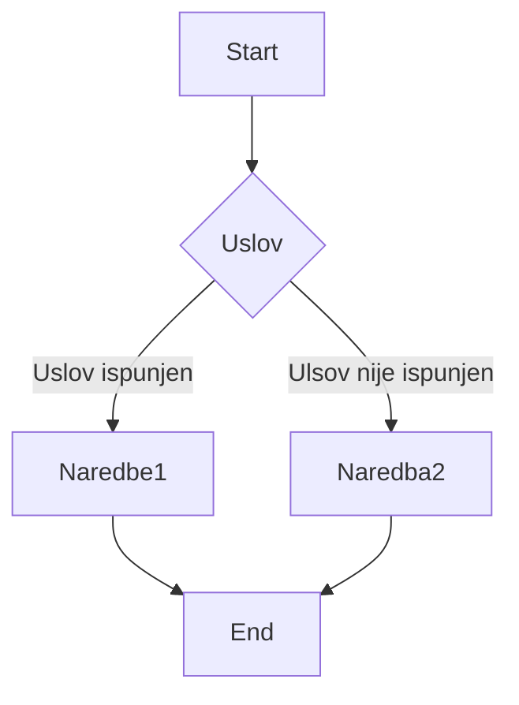
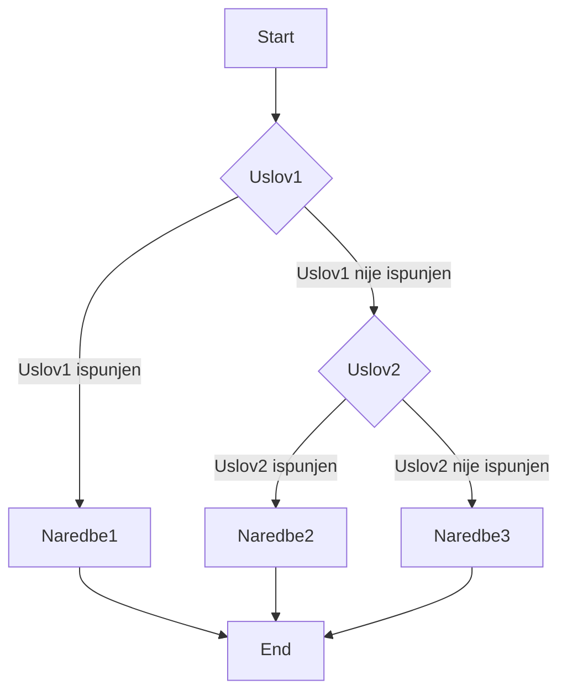

# Grananje

Programski kod se u ranijim poglavljima izvršavao naredbu po naredbu(linearno programiranje), te se naredba koja koja se izvršava ne zavisi striktono od ranijeg izvršenog koda. Mnogi problemi 
zahtijevaju dva ili više ishoda, u zavisnosti od određenih uslova. Grananje predstavlja promjenu toka izvršavanja programa i  omogućavanje specifičnijeg reagovanja programa u zavisnosti  od ispunjenje uslova

## If
>**If** naredba je osnovna kontrolna struktura u programiranju koja omogućava izvršavanje određenih 
blokova koda samo ako se određeni uslov ili izraz ima tačnu(istinitu) vrijednost.

Koristi se za upravljnje tokom izvršavanja programa na osnovu trenutnih uslova. U suštini, **if** 
naredba omogućava programu da donosi odluke i izvršava određene djilove koda samo ako su ispunjeni određeni uslovi. 

Dijagram toka if naredbe izgleada ovako:


If naredba se piše ovako:
```python
if uslov:
    blok_naredbi
```

> Za razliku od drugih programskih jezika koji koriste vitičaste zagrade **{ }** za odvajanje posebnih dijelva koda, Python koristi indentacije(1 tab) 

Uslovi u  **if** naredbi mogu osnovni matematički operatori kao što su jednako (==), različito (!=), manje (<), veće (>) i modul operator (%)
```python
if  10 > 5:
    print(" 10 je veće od 5")
```

## Else
> **If** naredba omogućava provjeru uslova i izvršavanje bloka koda, ako je uslov tačan.

>**Else** se koristi za izvršavanje bloka koda kada uslov nije tačan.



```python
if uslov:
    blok_naredbi_1
else:
    blok_naredba_2
```

Svaka **if** naredba može da ima samo jednu **else** naredbu.
```python
if x % 2 == 0:
    print("Broj je paran")
else:
    print("Broj je neparan")
```

## Elif

Mnogi problemi zahtijevaju za ispitivanjem višestruikh uslova, standardna struktura odluke **if-else**
ne zadovoljava. Što začni da ako bi smo željeli ispitati više uvijeta na standardni način if-else uvjetovanjem,
morali bi smo ugnijezditi više if-else uvijeta. To bi učinilo kod vrlo nečitljivim i teškim za razumijeti i napisati.

>Standardna **if-else** naredba se nadopunjuje sa **elif** naredbom

>**Elif** (kratko za **else if**) pravi kod kraćim, čitljivijim i lakšim za razumijeti. 



```python
if uslov1:
    blok_naredbi_1
elif uslov2:
    blok_naredba_2
elif uslov3:
    blok_naredbi_3
...
else:
    naredba_n
```

Za razliku od **else** naredbe, **elif** naredba se može koristi više puta za jednu **if** naredbu
Može se razumijeti kao "Ako if nije ispunjen onda ispitaj ovo..."
```python
if a > b:
    print("Broj",a,"je veći")
elif a < b:
    print("Broj",b,"je veći")
else:
    print("Brojevi su jedanki")
```

## Logički operatori
Često se dešava da problem koji se rješava zahtjeva da se više uslova provjeri od jednom if bloku. Tada se koriste **logički operatori**.

> Logički operatori su **and** (i), **or** (ili) i **nor** (ne).

Kada je potrebno navesti više uslova i pri tome da SVI USLOVI MORAJU BITI ISPUNJENI korisit se **and** operator.
```python
if (ocjena >= 85 and ocjena <= 100):
    print("Ocjena je 5")
```

Kada je potrebno navesti više uslova i pri tome da BAR JEDAN USLOV MORA BITI ISPUNJEN korisit se **or** operator.

```python
if (x < 0 or  x > 100):
    print("Nevalidan unos")
```

Kada je potrebno da navedeni uslov NIJE ISPUNJEN onda se koristi **not** operator.

```python
if (not x % 2 == 0):
    print("Broje je neparan")
```

Operatori poređenja imaju veći prioritet od logičkih operatora, tj. operatori poređenja će se izvršiti prvi, pa tek ondalogički operatori.
