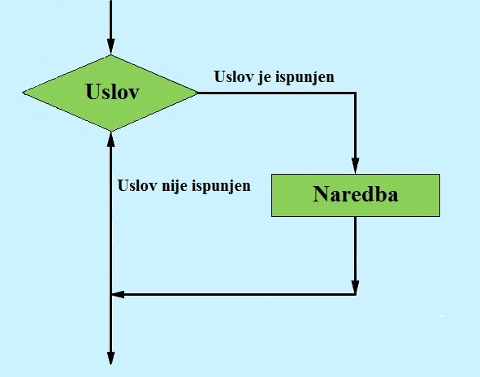
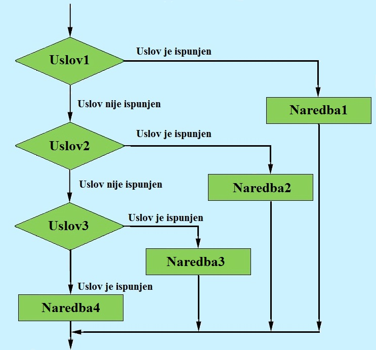

# Grananje

Programski kod se u ranijim poglavljima izvršavao naredbu po naredbu(linearno programiranje), te se naredba koja koja se izvršava ne zavisi striktono od ranijeg izvršenog koda. Mnogi problemi 
zahtijevaju dva ili više ishoda, u zavisnosti od određenih uslova. Grananje predstavlja promjenu toka izvršavanja programa i  omogućavanje specifičnijeg reagovanja programa u zavisnosti  od ispunjenje uslova

## If
>**If** nardeba je osnovna kontrolna struktura u programiranju koja omogućava izvršavanje određenih 
blokova koda samo ako se određeni uslov ili izraz ima tačnu(istinitu) vrijednost.

Koristi se za upravljnje tokom izvršavanja programa na osnovu trenutnih uslova. U suštini, **if** 
nardeba omogućava programu da donosi odluke i izvršava određene djilove koda samo ako su ispunjeni određeni uslovi. 

Dijagarm toka if naredbe izgleada ovako

{ width="400" }


If naredba se piše ovako
<pre>
```python
if uslov:
    blok_nardebi
```
</pre>

> Za razliku od drugih programskih jezika koji koriste vitičaste zagrade **{}** za odvajanje posebnih dijelva koda, Python koristi indentacije(1 tab) 

 Uslovi u  **if** naredbi mogu osnovni matematički operatori kao što su jednako(==), različito(!=), veće/manje(>) i modul operator(%)

Primjer 
<pre>
```python
if  10 > 5:
    print(" 10 je veće od 5")
```
</pre>

## Else
> **If** naredba omogućava provjeru uslova i izvršavanje bloka koda, ako je uslov tačan.

>**Else** se koristi za izvršavanje bloka koda kada uslov nije tačan.

{ width="400" }

<pre>
```python
if uslov:
    blok_nardebi_1
else:
    blok_nardeba_2
```
</pre>

Svaka **if** naredba može da ima samo jednu **else** naredbu.

Primjer
<pre>
```python
if x % 2 == 0:
    print("Broj je paran")
else:
    print("Broj je neparan")
```
</pre>

## Elif

Mnogi problemi zahtijevaju za ispitivanjem višestruikh uslova, standardna struktura odluke **if-else**
ne zadovoljava. Što začni da ako bi smo željeli ispitati više uvijeta na standardni način if-else uvjetovanjem,
morali bi smo ugnijezditi više if-else uvijeta. To bi učinilo kod vrlo nečitljivim i teškim za razumijeti i napisati.

>Standardna **if-else** naredba se nadopunjuje sa **elif** naredbom

>**Elif** (kratko za **else if**) pravi kod kraćim, čitljivijim i lakšim za razumijeti. 

{ width="400" }

<pre>
```python
if uslov1:
    blok_nardebi_1
elif uslov2:
    blok_nardeba_2
elif uslov3:
    blok_nardebi_3
...
else:
    nardeba_n
```
</pre>

Za razliku od **else** naredbe, **elif** naredba se može koristi više puta za jednu **if** naredbu
Može se razumijeti kao "Ako if nije ispunjen onda ispitaj ovo..."

Primjer

<pre>
```python
if a > b:
    print("Broj",a,"je veći")
elif a < b:
    print("Broj",b,"je veći")
else:
    print("Brojevi su jedanki")
```
</pre>

##Logički operatori
Često se dešava da problem koje se riješava zahtjeva više da se više uslova provjeri od jednom uif bloku. Tada se
koriste **logički operatori**.

> Logčki operatori su **and**(i),**or**(ili) i **nor**(ne).

> Kada je potrebno navesti više uslova i pri tome da SVI USLOVI MORAJU BITI ISPUNJENI korisit se **and** operator.

<pre>
```python
if (ocjena >= 85 and ocjena <= 100):
    print("Ocjena je 5")
```
</pre>

> Kada je potrebno navesti više uslova i pri tome da BAR JEDAN USLOV MORA BITI ISPUNJEN korisit se **or** operator.

<pre>
```python
if (x < 0 or  x > 100):
    print("Nevalidan unos")
```
</pre>

>Kada je potrebno da navedeni uslov NIJE ISPUNJEN onda se koristi **not** operator.

<pre>
```python
if (not x % 2 == 0):
    print("Broje je neparan")
```
</pre>

Operatori poređenja imaju veći prioritet od logičkih operatora, tj. operatori poređenja će se izvršiti prvi, pa tek onda
logički operatori.