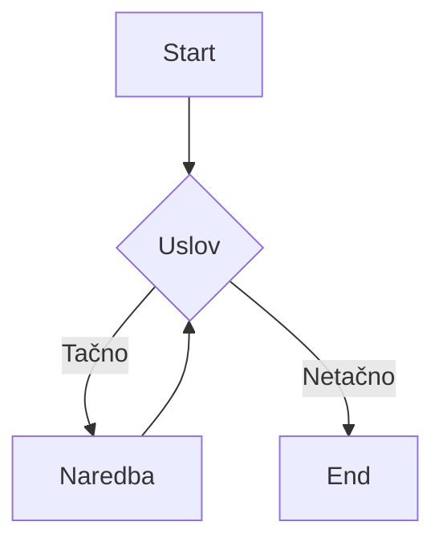

# Petlje

>**Petlje** su programske strukture koje omogućavaju višestruko ponavljanje 
određenog dijela koda (bloka koda).

Kao i [if-else naredbe](/content/basics/If-else%20naredba), petlje sadrže uslov. Ukoliko je uslov ispunjen blok koda se ponavlja određeni broj puta, sve dok se uslov postane netačan.



Postoje  dvije vrste petlji:

>   - petlje kontrolisane brojačem (**for** petlje)
>   - petlje kontrolisane uslovom (**while** petlje)

## For petlja

>**For** petlja se korisiti u situcijama u kojima se unaprijed određen
broj ponavljana petlje.

Ona je brojačka petlja.
```python
for i in range(a, b, k):
    blok_naredbi
```

Za prolazak kroz niz cijelih brojeva koristi se **range** funkcija

- a - početna vrijednost petlje (brojača)
- b - krajnja vriednost petlje (brojača)
- k - korak petlje (brojača). 1 po defaultu.

```python
for i in range(1, 6):
    print(i)
```

```python
Output: 1
        2
        3
        4
        5
```

## While petlja

>**While** petlja omogućava ponavljanje kada je određeni uslov ispunjen.

Korisi se kada ne znamo tača broj ponavljanja.
Ova petlja je uslovna petlja.
```python
while uslov:
    blok_naredbi
```

```python
i = 1
while i <= 5:
    print(i)

```

```python
Output: 1
        2
        3
        4
        5
```

Podložna je logičkim greškama (beskonačna petlja). Zbog toga se koriste funkcije **break** i **continue**

> Funkcija **break** se koristi za izlaz iz petlje.

```python
i = 1
while i <= 5:
    if i == 3:
        brak
    print(i)
```

```python
Output: 1
        2
        3
```

Funkcija **continue** se koristi za preskakanje iteracije.
Odnosno, zaustavlja trenutnu iteraciju i nastavlja sa sljedećom.

```python
i = 1
while i <= 5:
    if i == 3:
        continue
    print(i)
```

```python
Output: 1
        2
        4
        5
```

## Ugnježdene petlje

>**Ugnježdene petlje** prestavljaju petlju unutar petlje.

Kada se petlja nalazi unutar druge petlje, za svaku iteraciju vanjske petlje unutarnja petlja mora proći kroz sve svoje iteracije.

```python
for i in range(a, b, k):
    for j in range(c, d, e):
        blok_naredbi_2
    blok_naredbi_1
```

```python
for i in range(0, 5):
    for j in range(0, i + 1):
        print("*", end=' ')
    print()
```

```python
Output: *
        * *
        * * *
        * * * *
        * * * * *
```

