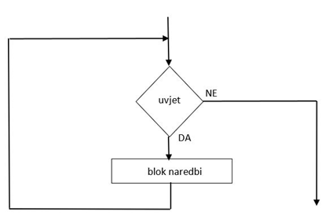

# Petlje

>**Petlje** su programske strukture koje omogućavaju višestruko ponavljanje 
određenog dijela koda(bloka koda).

Kao i if-else naredbe, petlje sadrže uslov. Ukoliko je uslov ispunjen
blok koda se ponavlja određeni broj puta, sve dok se uslov postane netačan.

{ width="400"}

>Postoje  dvije vrste petlji:

>>  -petlje kontrolisane brojačem(**for** petlje)

>>  -petlje kontrolisane uslovom(**while** petlje)

##For petlja

>**For** petlja se korisiti u situcijama u kojima se unaprijed određen
broj ponavljana petlje.

Ona je brojačka petlja.

<pre>
```python
for i in range(a, b, k):
    blok_naredbi
```
</pre>

> Za prolazak kroz niz cijelih brojeva koristi se **range** funkcija

- a - početna vrijednost petlje(brojača)
- b - krajnja vriednost petlje(brojača)
- k - korak petlje(brojača)

<pre>
```python
for i in range(1, 6):
    print(i)
```
</pre>
<pre>
```python
Output: 1
        2
        3
        4
        5
```
</pre>

##While petlja

>**While** petlja omogućava ponavljanje kada je određeni uslov ispunjen.

Korisit se kada ne znamo tača broj ponavljanja.
Ova petlja je uslovna petlja.

<pre>
```python
while uslov:
    blok_naredbi
```
</pre>

<pre>
```python
i = 1
while i <= 5:
    print(i)

```
</pre>
<pre>
```python
Output: 1
        2
        3
        4
        5
```
</pre>

Podložna je logičkim greškama(beskonačna petlja). Zbog toga se koriste funkcije **break** i **continue**

>Funkcija **break** se koristi za izalz iz petlje.

<pre>
```python
i = 1
while i <= 5:
    if i == 3:
        brak
    print(i)
```
</pre>
<pre>
```python
Output: 1
        2
        3
```
</pre>

>Funkcija **continue** se koristi za preskaknje iteracije.

Odnosno, zaustavlja trenutnu iteraciju i nastavlja sa sljedećom.

<pre>
```python
i = 1
while i <= 5:
    if i == 3:
        continue
    print(i)
```
</pre>
<pre>
```python
Output: 1
        2
        4
        5
```
</pre>

## Ugnježdene petlje

>**Ugnježdene petlje** prestavljaju petlju unutar petlje.

Kada se petlja nalazi unutar druge petlje, za svaku iteraciju vanjske petlje unutarnja petlja mora proći kroz sve svoje iteracije.

<pre>
```python
for i in range(a, b, k):
    for j in range(c, d, e):
        blok_naredbi_2
    blok_naredbi_1
```
</pre>

<pre>
```python
for i in range(0, 5):
    for j in range(0, i + 1):
        print("*", end=' ')
    print()
```
</pre>
```python
Output: *
        * *
        * * *
        * * * *
        * * * * *
```
</pre>

